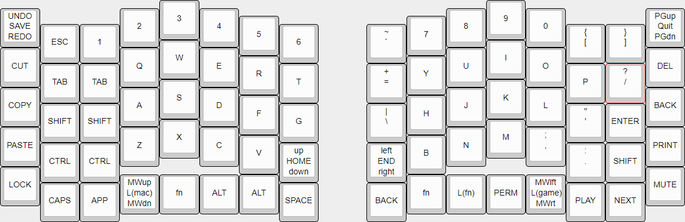

# SplittoDogu
QMK firmware for split keyboard with screens and encoders

This is a split keyboard with encoders for arrow keys, mouse wheels, page up/down, and undo/redo.
One of the two screens shows the active layer and status of Num and Caps.
The other screen is for Bongo Cat...

## Layouts
There are two nearly identical default layouts. One for Windows and the other for MAC.
The differences are key combinations for undo/redo and other hotkeys.

Next is a layer for gaming, which shifts most buttons on the left half to the right by one key.
This is moves WASD to the optimal position.

The last layer FN is for F1 to F12, arrow keys, and the keypad.

## PCB
The PCB can be used for both sides. It's possible to use one half without the other.
So select which side a board is used for, bridge the jumper points under the OLED screen.
JP_L1 to JP_L6 for the left side, JP_R1 to JP_R6 for the right.
The Elite-C must be flipped depending on the side. (See images)

## Case
The case is a simple sandwich case with a clear part covering the chip and screen.
The main case uses 8mm standoffs, while the clear part uses 11mm. (See BOM)

## BOM
A list with all parts used and their approximate price as of March 2022.
